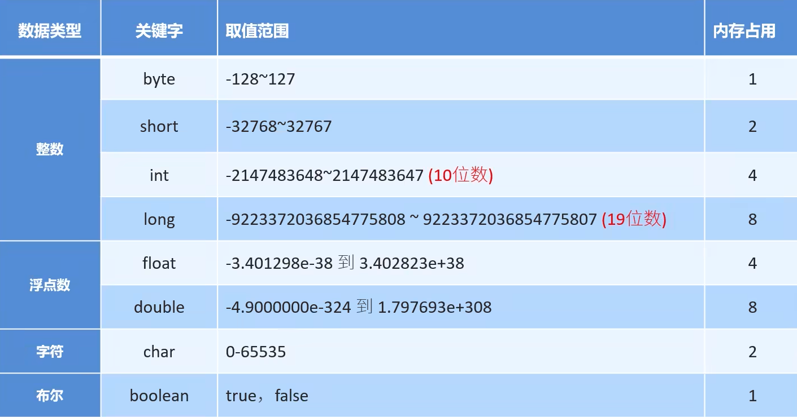
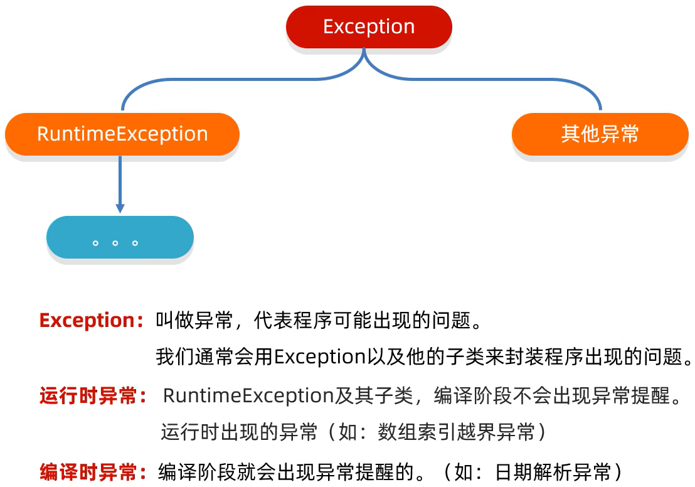
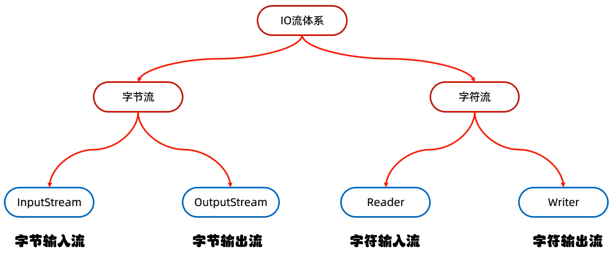
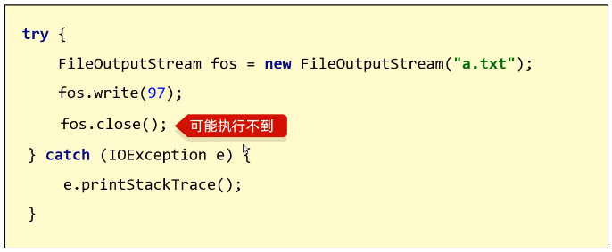
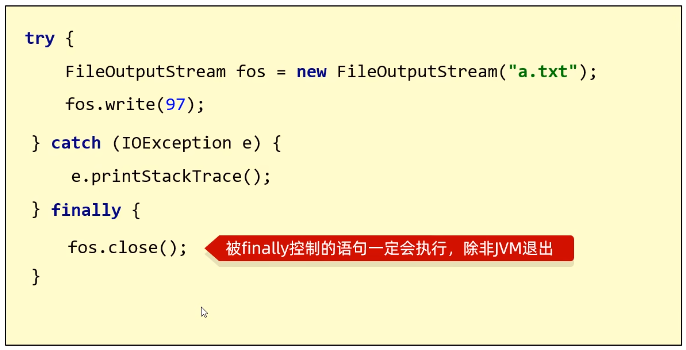
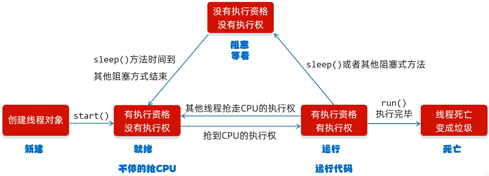
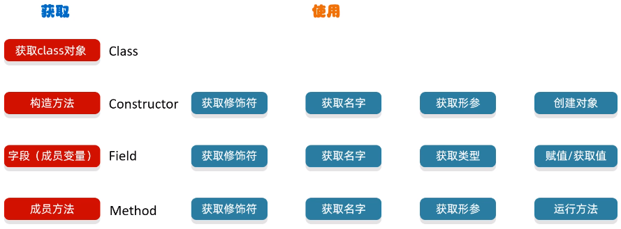

# 1 Java 基础语法

## 1.1 Hello， World!

```java
public class Hello{
    public static void main(String[] args){  //main方法，程序的主入口
        System.out.println("Hello, World!");  //输出语句
    }
}
```

### 代码注释

```java
//单行注释

/*
    多行
    注释
*/
```

* 注释的内容不参与编译和运行，仅存在于源代码文件中
* 多行注释不允许嵌套

### 标识符命名规则（强制）

* 只能由 26 个英文字母大小写、0-9、\_ 或 $ 组成；
* 不能以数字开头；
* 不能是关键字或保留字，但是可以包含关键字或保留字；
* Java 严格区分大小写，不限制标识符的长度，但是标识符内不能包含空格。

### 标识符命名规范（推荐但不强制）

* 包名：多单词组成时所字母都小写；
* 类名、接口名：多单词组成时每个单词的首字符大写；
* 变量（属性）名、方法名：多单词组成时，除第一个单词之外每一个单词的首字母都大写； 
* 常量名：每一个字母都大写，多单词时每个单词之间用 `_` 连接。

### 字面量和变量

**字面量：**


**变量：**

* Java 中的变量必须在声明之后使用，因为只有在声明后这个变量才会在内存中被加载；
* 局部变量声明之后不会被自动初始化，因此局部变量在使用之前必须先进行显式初始化（赋初值）；
* 变量都是定义在其作用域内的，只在这个作用域内有效，其作用域就是声明这个变量时所在的花括号内的范围；
* **同一个作用域内不可以声明两个同名的变量**（哪怕他们的类型不同），同一个变量不可以在同一个作用域内多次定义。

**局部变量与成员变量：**

* 局部变量：定义在方法的形参列表或方法体内的变量。
* 成员变量（属性）：定义在类的 `{ }` 内部的变量。
* 二者相同点
    * 定义变量的格式相同：`数据类型 变量名 = 变量值;`
    * 都要求先声明，后使用；
    * 两种变量都有其对应的作用域。
* 二者不同点
    * 在类中声明的位置不同——成员变量直接定义在类的 `{ }` 内；局部变量声明在方法内、方法形参、代码块内、构造器形参和构造器内；
    * 关于权限修饰符——成员变量可以在声明时通过使用权限修饰符，指明其权限；局部变量不可以使用权限修饰符；
    * 默认初始化值的情况——成员变量，根据其数据类型都有对应的默认初始化值；局部变量没有默认初始化值，我们在调用局部变量之前一定要显式赋值（形参在调用时赋值即可）；
    * 在内存中加载的位置——非 static 的成员变量加载到堆空间中，static 的成员变量加载到方法区；局部变量都加载到栈空间。

## 1.2 数据类型

### 1.2.1 基本数据类型



* 整数字面值默认为 `int` 类型，可加后缀 L 将其指定为 `long` 类型；
* 小数字面值默认为 `double` 类型，可加后缀 F 将其指定为 `float` 类型；
* 整数和小数类型的取值范围大小关系：`double` >` float` > `long` > `int` > `short` > `byte`。

### 1.2.2 引用数据类型

## 1.3 运算符

### 1.3.1 算术运算符


**说明：**

* 计算时有小数参与，则算术运算的结果一定是小数，且**结果有可能是不精确的**；
* 整数之间的除法，结果是整数，采用**截断方式**，不会四舍五入；
* 小数参与除法运算，结果也可能是不精确的；
* 取模运算实际上也是除法运算，只是得到的结果是余数。

### 1.3.2 数据类型的转换


隐式转换又叫**自动类型提升**，由程序自动完成：

* 取值范围小的和取值范围大的进行运算，小的会先提升为大的，再进行运算；
* byte、short、char 三种类型的数据在运算的时候，都会直接先提升为 int， 然后再进行运算。

```java
byte a = 10;
byte b = 20;
int c = a + b; //自动类型提升为 int
```

强制转换是**截断**操作，需要加入强制转换：

* 格式：`目标数据类型 变量名 = (目标数据类型)被强转的数据`；
* 若被强转的数据过大，则在强转的结果就会发生错误。

### 1.3.3 字符串和字符的加操作

* 当 + 操作中出现字符串时（无论在前还是在后），这个 + 是字符串连接符，而不是算术运算符了。会将 + 前后的数据进行拼接，并会产生一个新的字符串；
* 连续进行 + 操作时，从左到右逐个执行；


* 字符相加：


### 布尔类型

## 1.4 流程控制

## 1.5 数组

## 1.6 集合

# 2 Java 面向对象

# 3 Java 高级

## 3.1 常用 API

### 3.1.1 Object

### 3.1.2 Objects

### 3.1.3 包装类

&emsp;&emsp;包装类就是把基本数据类型的数据包装成对象。

| 基本数据类型 | 对应的包装类 |
|--------------|--------------|
| byte         | Byte         |
| short        | Short        |
| int          | Integer      |
| long         | Long         |
| char         | Character    |
| float        | Float        |
| double       | Double       |
| boolean      | Boolean      |

* 自动装箱：基本数据类型可以自动转换为包装类型
* 自动拆箱：包装类型可以自动转换为基本数据类型

### 3.1.4 字符串操作

#### 模式匹配

#### 编码和解码

|               String 类中的方法              |         说明         |
|:--------------------------------------------:|:--------------------:|
|          `public byte[] getBytes()`          | 使用默认方式进行编码 |
| `public byte[] getBytes(String charsetName)` | 使用指定方式进行编码 |
|            `String(byte[] bytes)`            | 使用默认方式进行解码 |
|  `String(byte[] bytes, String charsetName)`  | 使用指定方式进行解码 |

```java
String str = "ai你呦～";

//编码
byte[] bytes = str.getBytes("GBK");

//解码（String 的构造方法）
String res = new String(bytes,"GBK");
```

## 3.2 异常处理

### 3.2.1 关于异常



```java
class ExceptionDemo{
    public static void main(String[] args){
    }

    public void parseExceptionDemo(){
        String time = "2024年3月15日";
        SimpleDateFormat sdf = new SinpleDateFormat("yyyy年mm月dd日");
        Date date = sdf.parse(time);
        System.out.println(date);
    }//引发编译时异常

    public void runtimeExceptionDemo(){
        int[] arr = {1,2,3,4,5};
        System.out.println(arr[10]);
    }//引发运行时异常
}
```

* 作用一：用来查询 bug 的关键参考信息
* 作用二：可以作为方法内部的一种特殊返回值，以便通知调用者底层的执行情况

### 3.2.2 异常的处理方式

#### JVM 的默认异常处理方式

&emsp;&emsp;不做任何处理，让 JVM 用默认的方式处理异常。把异常的名称，异常原因以及异常出现的位置等信息输出到控制台；程序停止执行，异常下面的代码就不会再执行了。

#### 自己处理（捕获异常）

```java
try{
    可能出现异常的代码;
}catch(异常类名 变量名){
    异常的处理代码;
}

int[] arr = {1,2,3,4,5};
try{
    System.out.println(arr[10]);//会出现数组访问越界 的异常
    //此处出现了异常，程序会在这里创建一个 ArrayIndexOutOfBoundsException 的对象
    //  new ArrayIndexOutOfBoundsException();
    //  拿着这个对象和 catch 括号中进行对比，看看括号中的变量是否可以接收这个对象，如果能被接收，就表示该异常被捕获，执行 catch 里面对应的代码
}catch(ArrayIndexOutOfBoundsException e){
	System.out.println("索引越界了");
}
System.out.println("看看我执行了吗");//无论上述代码是都发生异常，后续语句都会执行
```

好处：当代码出现异常时，**可以让程序继续往下执行**，不会停止。

> 如果 try 中没有遇到问题，怎么执行？
>
> > 会把 try 中的所有代码全部执行完毕，不会执行 catch 中的代码

> 如果 try 中可能遇到多个问题，怎么执行？
>
> > 我们需要写多个 catch，与之分别对应（不同的异常会有不同的处理方案）
> >
> > 细节：捕获的多个异常之间存在父子关系，则父类一定要写在下面，子类写在上面

> 如果 try 中遇到的问题没有被捕获到，怎么执行？
>
> > 使用 JVM **默认异常处理**方式

> 如果 try 中遇到了问题，那么 try 下面的其他代码还会执行吗？
>
> > 不会

**处理异常的方法：**

```java
int[] arr = {1,2,3,4,5};

try{
    System.out.println(arr[10]);
}catch(ArrayIndexOutOfBoundsException e){
    //public String getMessage()  返回此 throwable 的详细消息字符串
    String message = e.getMessage();
    System.out.println(message);

    //public String toString()  返回此 throwable 的尖简短描述
    String str = e.toString();
    System.out.println(str);

    //public void printStackTrace()   在底层利用 System.err.println() 把异常的错误信息输出到控制台（跟 JVM 默认异常处理方式的不同：仅仅打印信息，不终止程序的运行）
    e.printStackTrace();
}
```

#### 把异常交给调用者（抛出异常）

`throws` 关键字：写在方法定义处，表示声明一个异常；告诉调用者，使用本方法可能会有哪些异常。

```java
public static String recordName() throws Exception{ //运行时异常可以不写；编译时异常必须写明
  Scanner scanner = new Scanner(System.in);
  String name = scanner.nextLine();

  if(name.length() < 3 || name.length() > 10){
      throw new Exception();
  }

  return name;
}
```

`throw` 关键字：写在方法内，结束方法，手动抛出异常对象，交给调用者，方法中后面的代码不会再继续执行了

```java
public static void main(){
	int[] arr = null;
	int max = 0;
	
	try{
		max = getMax(arr);
	}catch(NullPointerException e){
		System.out.println("空指针异常");
	}catch(ArrayIndexOutOfBoundsException e){
		System.out.println("索引越界异常");
	}
	
	System.out.println(max);
}

//public static int getMax(int[] arr) throws NullPointerException, ArrayIndexOutOfBoundsException {
//运行时异常，可不写
public static int getMax(int[] arr){
	if(arr == null){
		//手动创建一个异常对象，并把这个异常对象交给本方法的调用者处理
		//此时方法就会结束，下面的代码就不会继续执行
		throw new NullPointerException();
	}

	if(arr.length == 0){
		throw new ArrayIndexOutOfBoundsException();
	}
	
	int max = arr[0];
	for(int i = 1;i < arr.length;i++){
		if(arr[i] > max){
			max = arr[i];
		}
	}
	return max;
}
```

### 3.2.3 自定义异常

&emsp;&emsp;自定义一个已有异常类的子类。

```java
class AgeOutOfBoundsException extends RuntimeException{
    public AgeOutOfBoundsException(){
    }

    public AgeOutOfBoundsException(String message){
        super(message);
    }
}
```

## 3.3 文件类 File

&emsp;&emsp;File 对象就**表示一个路径**，可以是文件的路径、也可以是文件夹的路径。这个路径可以是存在的，也允许是不存在的。

### 3.3.1 文件对象的三种构建方法

1. 根据字符串表示的路径，获取 File 对象

```java
String str = "C:\\Users\\x41v3r\\Desktop\\a.txt";
File file1 = new File(str);
System.out.println(file1);//C:\Users\x41v3r\Desktop\a.txt
```

2. 根据子路径的名称和父路径的名称创建文件对象

&emsp;父路径：C:\Users\x41v3r\Desktop

&emsp;子路径：a.txt

```java
String parent = "C:\\Users\\x41v3r\\Desktop";
String child = "a.txt";
File file2 = new File(parent,child);
System.out.println(file2);//C:\Users\x41v3r\Desktop\a.txt
```

3. 把一个 File 表示的路径和一个 String 表示的路径进行拼接

```java
File parent1 = new File("C:\\Users\\x41v3r\\Desktop");
String child1 = "a.txt";
File file3 = new File(parent1,child1);
System.out.println(file3);//C:\Users\x41v3r\Desktop\a.txt
```

### 3.3.2 判断和获取信息

```java
public boolean isDirectory()//判断此路径表示的 File 是否为文件夹
public boolean isFile()//判断此路径名表示的 File 是否为文件
public boolean exists()//判断此路径表示的 File 是否存在

public String getAbsolutePath()//返回文件的绝对路径，无论定义文件时使用的是什么路径（相对 or 绝对）
public String getPath()//返回定义文件时使用的路径
public String getName()//返回文件的名称，带后缀（如果调用的文件夹，那么返回的是文件夹的名字）

public long length()//返回文件的大小（字节数量），只能获取文件的大小，不能获取文件夹的大小
public long lastModified()//返回文件的最后修改时间（时间毫秒值）
```

### 3.3.3 创建和删除

```java
public void createFileTest() throws IOException{
    File file1 = new File("C:\\Users\\x41v3r\\Desktop\\a.txt");
    boolean b = file1.createNewFile();
    System.out.println(b);

    /*
    1.
        当前路径表示的文件不存在，则创建成功，返回 true
        当前路径表示的文件存在，则创建似乎白，返回 false
    2.如果当前路径的中指定的父级路径不存在
        则会引发异常 IOException
    3.createNewFile() 方法创建的一定是文件
    */
}
```

```java
public void createDirTest() throws IOException{
    File file1 = new File("C:\\Users\\x41v3r\\Desktop\\aaa");
    boolean b1 = file1.mkdir();
    System.out.println(b);
    /*
        1.OS 中的路径是唯一的，如果当前路径已经存在，则创建失败，返回 false
        2.mkdir() 只能创建单级文件夹，不能创建多级文件夹
    */

    File file2 = new File("C:\\Users\\x41v3r\\Desktop\\aaa\\bbb\ccc");
    boolean b2 = file2.mkdirs();
    System.out.println(b);
    /*
        mkdirs() 函数也可以创建多级文件夹，底层本质上是调用的 mkdir() 方法
    */
}
```

```java
public void deleteTest() {
    File file1 = new File("C:\\Users\\x41v3r\\Desktop\\a.txt");
    boolean b = file1.delete();
    System.out.println(b);
    /*
    1.如果要删除的路径不存在
    2.
        如果删除的是文件，则直接删除，不走回收站
        如果删除的是空文件夹，则直接删除，同样不走回收站
        如果删除的是有内容的文件夹，则返回 false，删除失败
    */
}
```

### 3.3.4 获取并遍历

```java
File f = new File("C:\\Users\\x41v3r\\Desktop\\aaa");

File[] files = f.listFiles();//获取 aaa 文件夹中的所有内容，把所有的的内容放到数组中返回
for(File file : files){
	//file 一次表示文件夹里面的每一个文件或文件夹
	System.out.println(file);
}
/*
1.当调用者 f 表示的路径不存在 或者 是文件时，返回 null
2.当调用者 f 表示的路径是一个空文件夹时，返回一个长度为 0 的数组
3.当调用者 f 表示的路径是一个有隐藏文件的文件夹时，会将里面的所有文件和文件夹的路径放在 File 数组中返回，包括隐藏文件
4.当调用者 f 表示的路径是一个需要有权限才能进入的文件夹时，返回一个 null
*/
```

## 3.4 IO 流

&emsp;&emsp;IO 流用于存储和读取（文件中或网络中的）数据。

**IO 流的体系结构：**



### 3.4.1 字节流

#### `FileOutputStream` 

&emsp;&emsp;操作本地文件的字节输出流，可以把程序中的数据写到本地文件中。

```java
//需求：写出一段文字到本地文件中

/*1.创建对象
  ->参数可以是字符串表示的路径，也可以是 File 对象
  ->如果路径指向的文件不存在，则会创建文件，但是需要保证文件的父级路径是存在的
  ->如果文件已经存在，则会清空文件，之后再写入内容
*/
FileOutputStream fileOutputStream = new FileOutputStream("a.txt");

/*2.写出数据
  ->write() 方法的参数是整数，但是实际写到本地文件中的是整数在 ASCII 上对应的字符
*/
fileOutputStream.write(97);

/*3.释放资源
  ->每次使用完流之后都要释放资源，否则会一直占用资源（程序执行结束之后，文件仍然被占用）
*/
fileOutputStream.close();
```

| 一次写入多个字符的方法                   | 作用                           |
| ---------------------------------------- | ------------------------------ |
| `void write(byte[] b)`                   | 一次写入一个字节数组的全部数据 |
| `void wirte(byte[] b, int off, int len)` | 一次写入一个字节数组的部分数据 |

```java
//1.一次写入一个字节数组的全部数据
byte[] bytes = {97,98,99,100,101};
fos.write(bytes);

//2.一次写入一个字节数组的部分数据
//参数列表 (字节数组, 起始索引, 个数)
byte[] bytes = {97,98,99,100,101,102,103};
fos.write(bytes, 1, 2);
```

换行写：

```java
String str1 = "kankelaoyezuishuai";
byte[] bytes1 = str.getBytes();
fos.write(bytes1);

//写一个换行符
String strChange = "\r\n";//Windows 中的换行符
String strChange = "\n";//Linux 中的换行符
String strChange = "\r";//MacOS 中的换行符
byte[] bytesChange = strChange.getBytes();
fos.write(bytesChange);

String str2 = "666";
byte[] bytes2 = str2.getBytes();
fos.write(bytes2);
```

续写：

```java
FileOutputStream fileOutputStream = new FileOutputStream("a.txt", true);//设置 true 开启续写开关，默认关闭

fileOutputStream.write(97);

fileOutputStream.close();
```

#### `FileInputStream` 

&emsp;&emsp;操作本地文件的字节输入流，可以把本地文件中的数据读取到程序中来。

```java
/*1.创建文件输入刘对象
    ->如果文件不存在，则直接报错，不会创建文件
*/
FileInputStream fis = new FileInputStream("b.txt");

/*2.读数据
    ->每次读取一个字节，读出来返回的是字符在 ASCII 上对应的数字
    ->读到文件末尾了，再调用一个 read() 方法，返回 -1
*/
fis.read();

/*3.释放资源
*/
fis.close();
```

字节输入流循环读取：

```java
int b;
while((b = fis.read()) != -1){
    System.out.print((char)b);
}
```

一次读取多个字节：

```java
byte[] bytes[] = new byte[2];
fis.read(bytes);
//注意：一次读取多个数据，每次读取数据的个数即为数组的长度
//有返回值：表示本次读取到了多少个字节的数据，如果这次没有读到数据，则返回 -1
```

新的循环读取：

```java
byte[] bytes = new byte[5];

int num;
while((num = fis.read(bytes)) != -1){
  String str = new String(bytes, num);
  System.out.print(str);
}
```

### 3.4.2 字符流

&emsp;&emsp;读取纯文本文件时，不应当使用字节流，因为不同语言的文字所占的字节数可能不同，按字节读取会导致出现乱码。

产生乱码的原因有两个：

* 读取数据时未读完整个汉字（不好解决）
* 编码和解码的方式不统一（容易解决）

因此我们引入了字符流：


&emsp;&emsp;字符流的底层其实就是字节流。

特点：

* 输入流：一次读一个字节，遇到中文时，一次读多个字节
* 输出流：底层会把数据按照指定的编码方式进行编码，变成字节在写到文件中

#### `FileWriter`

1. 创建字符输出对象

| 构造方法                                             | 说明         |
| ---------------------------------------------------- | ------------ |
| `public FileWriter(File file)`                       | 根据文件对象 |
| `public FileWriter(String pathName)`                 | 根据路径名   |
| `public FileWriter(File file, boolean append)`       | 带续写       |
| `public FileWriter(String pathName, boolean append)` | 带续写       |

* 如果文件不存在，则会创建一个新的文件，但是要保证父级路径是存在的
* 如果文件已经存在，则会清空文件，如果不想清空，可以打开续写开关

2. 成员方法

| 成员方法                                         | 说明                     |
| ------------------------------------------------ | ------------------------ |
| `public void write(int c)`                       | 写出一个字符             |
| `public void wirte(String str)`                  | 写出一个字符串           |
| `public void wirte(String str,int off,int len)`  | 写出一个字符串的一部分   |
| `public void write(char[] cbuf)`                 | 写出一个字符数组         |
| `publci void wirte(char[] cbuf,int off,int len)` | 写出一个字符数组的一部分 |

* 如果 `write` 方法的参数是整数，则实际写到文件中的是其在字符集中对应的字符

3. 释放资源

|       成员方法       |   说明   |
| :------------------: | :------: |
| `public int close()` | 释放资源 |

#### `FileReader`

1. 创建字符输入对象

| 构造方法                         | 说明                                         |
|:--------------------------------:|:--------------------------------------------:|
|`public FileReader(File file)`      |通过文件对象，创建字符输入流关联本地文件      |
|`public FileReader(String pathname)`|通过文件路径字符串，创建字符输入流关联本地文件|

* 若文件不存在，则直接报错

2. 读取数据

| 成员方法                     |说明|
|:----------------------------:|:---:|
|`public int read()`             |读取一个数据，返回值为读取到的数据，读到末尾返回 -1|
|`public int read(char[] buffer)`|读取多个数据，返回值为本次读取到的字符的个数，本次未读到任何数据则返回 -1|

对于空参 read 方法：
* 按字节进行读取，遇到中文，一次读多个字节，读取后解码，返回一个整数
* 读到文件末尾了，`read` 方法返回 -1
* 在读取到数据之后，方法的底层会解码并转化为十进制，并最终把这个十进制作为方法的返回值（这个十进制数据也是就是当前字符在字符集上对应的数字）

3. 释放资源

| 成员方法           | 说明     |
|:------------------:|:--------:|
| `public int close()` | 释放资源 |

### 3.4.3 缓冲流

```java

```

### 3.4.4 流中的异常处理

错误思路：



正确思路：



正确实现：

```java
public static void iOExcecptionTest() {
    FileInputStream fis = null;//确定为未初始化
    FileOutputStream fos = null;//
    try {
        fis = new FileInputStream("/home/x41v3r/Desktop/MAD-81.mp4");
        fos = new FileOutputStream("/home/x41v3r/Desktop/MAD-81(new).mp4");
        int b = fis.read();
    }catch(IOException e) {
        e.printStackTrace();
    }finally {
        if(fis != null) {
            try {
                fis.close();
            }catch(IOException e) {
                e.printStackTrace();
            }
        }
        if(fos != null) {
            try {
                fos.close();
            }catch(IOException e) {
                e.printStackTrace();
            }
        }
    }
}
```

## 3.5 多线程

&emsp;&emsp;线程是计算机能够进行运算调度的最小单位，它被包含在**进程**之中，是进程中的实际运作单位。

&emsp;&emsp;当 JVM 虚拟机启动之后，会自动地启动多条线程，其中有一条线程就叫做 main 线程。main 线程的作用就是调用 main 方法，并执行里面的代码。

### 3.5.1 线程的多种实现方式

#### 继承 Thread 类的方式

1. 将类声明为 Thread 类的子类，该子类重写 Thread 类的 `run()` 方法。

```java
class MyThread extends Thread{
    @Override
    public void run(){
        //当前线程要执行的代码
        for (int i = 0;i < 100;i++){
            System.out.print(this.getName() + ": ");
            System.out.println("继承 Thread 类的方式");
            try {
                sleep(1000);
            } catch (InterruptedException e) {
                throw new RuntimeException(e);
            }
        }
    }
}
```

2. 创建并启动线程：

```java
MyThread t1 = new MyThread();
MyThread t2 = new MyThread();

t1.setName("线程1");
t2.setName("线程2");

t1.start();
t2.start();//启动线程
```

#### 实现 Runnable 接口的方式

1. 自己定义一个类，实现 Runnable 接口，并重写里面的 run 方法

```java
class MyRunnable implements Runnable{
    @Override
    public void run(){
        //线程执行的代码
         //当前线程要执行的代码
        for (int i = 0;i < 100;i++){
            Thread t = Thread.currentThread();//获取当前线程对象
            System.out.print(t.getName() + ": ");
            System.out.println("继承 Thread 类的方式");
        }
    }
}
```

2. 创建自己的类的对象

```java
MyRunnable mr = new MyRunnable();
```

3. 创建一个 Thread 类的对象，并开启线程

```java
Thread t = new Thread(mr);
t.start();
```

#### 利用 Callable 接口和 Future 接口方式

特点：可以获得多线程执行的结果。

1. 自己定义一个类，实现 Callable 接口，重写 call 方法（有返回值，表示线程运行的结果）

```java
class MyCallable implemants Callable<Integer>{//此处的泛型为返回的结果的类型
    @Override
    public Integer call() throws Exception{
        return null;
    }
}
```

2. 创建 MyCallable 的对象（表示多线程要执行的任务）

```java
MyCallable mc = new MyCallable();
```

3. 创建 FutureTask 对象（作用：管理多线程运行的结果）

```java
FutureTask<Integer> ft = new FutureTask<>(mc);
```

4. 创建 Thread 对象，并启动

```java
Thread t1 = new Thread(ft);
t1.start();

//获取多线程的运行结果
Integer result = ft.get();
```

### 3.5.2 常见的成员方法

#### 线程名称

```java
String threadName = t.getName();//默认是 Thread-X （X 为序号，从零开始）

t.setName("线程1");//设置一个自定义的名字

t.getName();//线程的名称变为了设定值
```

#### 获取当前线程对象

```java
Thread t = Thread.currentThread();//获取当前线程对象
```

#### 让线程休眠指定的时间

```java
Thread.sleep(1000);//休眠 1 秒
```

细节：

* 哪条线程执行到这条代码，那么哪条线程就会在这里停留对应的时间
* 方法的参数：表示睡眠的时间（单位：毫秒）
* 当时间到了之后，线程会自动醒来，继续执行后续代码

#### 线程优先级

| 方法名称                       | 说明             |
| ------------------------------ | ---------------- |
| `setPriority(int newPriority)` | 设置线程的优先级 |
| `final int getPriority()`      | 获取线程的优先级 |

&emsp;&emsp;Java 中的线程采用抢占式调度，线程的优先级越大，则这条线程抢到 CPU 的概率就越大。线程的优先级分为 10 档（1-10），如果没有设置则默认为 5 。

#### 守护线程（备胎线程）

&emsp;&emsp;程序中的线程分为守护线程和非守护线程，当非守护线程能够执行完毕之后，守护线程会陆续结束（不会立刻结束）。

```java
class MyThread1 extends Thread{
    @Override
    public void run(){
        for(int i = 1;i <= 10;i++){
            System.out.println(getName()+"@"+i);
        }
    }
}
class MyThread2 extends Thread{
    @Override
    public void run(){
        for(int i = 1;i <= 100;i++){
            System.out.println(getName()+"@"+i);
        }
    }    
}
```

```java
MyThread1 t1 = new MyThread1();
MyThread2 t2 = new MyThread2();

t1.setName("女神");
t2.setName("备胎");

t2.setDeamon(true);

t1.start();
t2.start();
```

#### 礼让（出让）线程

```java
```

#### 插入（插队）线程

```java
```

### 3.5.3 线程的生命周期



### 3.5.4 线程的安全问题

问题：某电影院目前正在上映国产大片，共有 100 张票，而它有 3 个窗口卖票，请设计一个程序模拟该电影院买票。

```java
class MyCallable implements Callable{
    @Override
    publiv void run(){
        
    }
}

class Main{
    
}
```

#### 同步代码块

&emsp;&emsp;把操作共享数据的代码锁起来，各个线程之间，对这段代码互斥访问。

```java
synchronized(锁){
    操作共享数据的代码
}
```

特点：

* 锁默认是打开的，有一个线程进去了，锁自动关闭
* 里面的代码全部执行完毕，线程出来，锁自动打开

```java
class MyThread extends Thread{
    //锁对象，可以是任何类的对象，必须是唯一的
    static Object obj = new Object();

    @Override
    public void run(){
        synchronized(obj){
            //不能写在循环的外面，否则资源都会被第一个进入代码块的线程访问完
            //各个线程之间互斥访问的代码
        }
        synchronized(MyThread.class){//一般使用当前类的类对象
        
        }
    }
}
```

```java
class MyThread extends Thread{
    @Override
    public void run(){
        synchronized(MyThread.class){
            :wq

        }
    }
}
```

#### 同步方法

&emsp;&emsp;就是把 synchronized 关键字用在方法上。

```java
修饰符 synchronized 返回值类型 方法名(参数列表){

}
```

* 同步方法会锁住内部的所有代码
* 同步方法不允许指定锁对象
    * 静态方法：this
    * 非静态方法：当前类的字节码文件对象

```java
class MyRunnable implements Runnable{
    int ticket;//Runable 内配置的只是一个配置，终究只会创建一个对象，不需要设置为静态

    &Override
    public void run(){
        method();
    }

    private synchronized void method(){
        //各个线程之间互斥访问的代码
    }//非静态的，锁对象为 MyRunnable 的对象，这个对象是唯一的
}

class Main{
    public static void main(String[] args){
        MyRunnable mr = new MyRunnable();
        Thread t1 = new Thread(mr);
        Thread t2 = new Thread(mr);
        Thread t3 = new Thread(mr);
        
        t1.start();
        t2.start();
        t3.start();
    }
}
```

#### Lock 锁

&emsp;&emsp;`synchronized` 的锁操作是自动完成的，为了更清晰的表达如何加锁和释放锁，JDK5 提供了一个新的锁对象 Lock。Lock 中提供了上锁和解锁的成员方法：

| 方法            | 作用   |
|-----------------|--------|
| `void lock()`   | 获得锁 |
| `void unlock()` | 释放锁 |

&emsp;&emsp;**`Lock` 是一个接口**，这里采用它的实现类 `ReentrantLock`。

```java
ReentrantLock rl = new ReentrantLock();
```

### 3.5.5 死锁

## 3.6 网络编程

### 3.6.1

## 3.7 反射

&emsp;&emsp;反射**允许对封装类的字段、方法和构造函数的（所有）信息进行编程访问**。



&emsp;&emsp;这些信息不是从源代码中获取的，而是从 class 字节码文件中获取的。

### 3.7.1 获取 class 对象的三种方式

#### `Class.forName("类全名")`（最为常用）

```java
Class clazz1 = Class.forName("org.example.senior.Student");
System.out.println(clazz1);
```

#### `类名.class`（用于传递参数）

```java
Class clazz2 = Student.class;
System.out.println(clazz2);
```

#### `对象.getClass()`（当我们已经有了这个类的对象时使用）

```java
Student s = new Student();
Class clazz3 = s.getClass();
System.out.println(clazz3);
```

### 3.7.2 利用反射获取构造方法

用于获取构造方法的方法

| 方法                                                               | 说明                           |
| ------------------------------------------------------------------ | ------------------------------ |
| `Constructor<?>[] getConstructors()`                               | 返回所有公共构造方法对象的数组 |
| `Constructor<?>[] getDeclaredConstructors()`                       | 返回所有构造方法对象的数组     |
| `Constructor<T> getConstructor(Class<?>...parameterTypes)`         | 返回单个公共构造方法对象       |
| `Constructor<T> getDeclaredConstructor(Class<?>...parametertypes)` | 返回档的构造方法对象           |

用于创建对象的方法

| 方法                            | 说明                          |
| ------------------------------- | ----------------------------- |
| T newInstance(Object..initargs) | 根据指定的构造方法创建对象    |
| setAccessible(boolean flag)     | 设置为 true，表示取消访问权限 |

### 3.7.3 利用反射获取成员变量


### 3.7.4 利用反射获取成员方法


