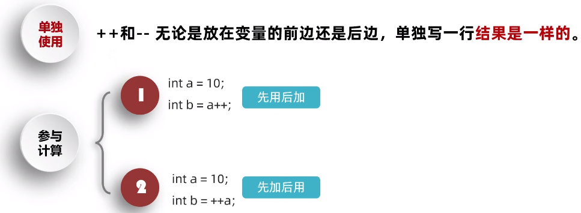
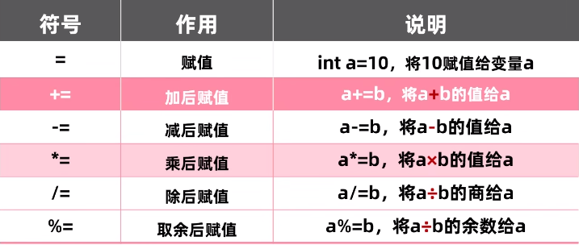
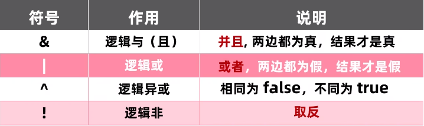
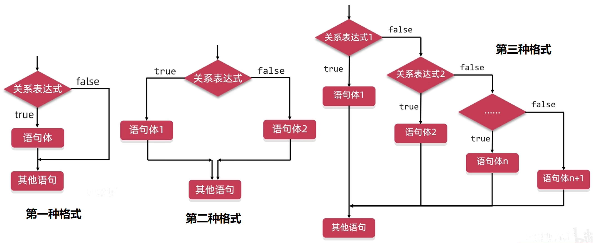

# 一、基础语法

```java
public class Hello{
    public static void main(String[] args){  //main方法，程序的主入口
        System.out.println("Hello, World!");  //输出语句
    }
}
```

> 

## 1.数据类型

### （1）

#### 字面量


#### 变量

* Java 中的变量必须在声明之后使用，因为只有在声明后这个变量才会在内存中被加载；
* 局部变量声明之后不会被自动初始化，因此局部变量在使用之前必须先进行显式初始化（赋初值）；
* 变量都是定义在其作用域内的，只在这个作用域内有效，其作用域就是声明这个变量时所在的花括号内的范围；
* **同一个作用域内不可以声明两个同名的变量**（哪怕他们的类型不同），同一个变量不可以在同一个作用域内多次定义。

#### 


### （3）

## 2.运算符

### （1）算术运算符


### （2）数据类型的转换


### （3）字符串和字符的加操作


### （4）自增自减运算符




### （5）赋值运算符



* +=、-=、\*=、/=、%= 的底层都隐藏了一个强制类型转换

```java
short s = 1;
s += 1;
//在底层等同于 s = (short)(s+1)
```

### （6）关系运算符


* 关系运算符的结果都是 boolean 型，要么是 `true`，要么是 `false`

### （7）逻辑运算符



* 取反的感叹号要么不写，要么只写一次

### （8）短路逻辑运算符


* 所谓短路效果，就是指左边的表达式已经能够确定结果，则右边的表达式就没有必要再参与运行了，这种情况下程序根本不会执行右边的表达式。

```java
int a = 10;
int b = 10;
boolean result = ++a < 5 && ++b < 5;
System.out.println(result);
System.out.println(a);  //左侧的表达式执行了，a 的值是 11
System.out.println(b);  //右侧的表达式未执行，b 的值还是 10
```

### 9）三元运算符

* 格式：`关系表达式?表达式1:表达式2`
* 先执行关系表达式
	* 关系表达式为真，则执行表达式1
	* 关系表达式为假，则执行表达式2
* 三元运算符所表示的是一个表达式，**必须要被使用**，不是一个独立的程序语句。

### 10）运算符的优先级

* 别管那些乱七八糟的，加小括号就行了。

## 3.流程控制

### 1）顺序结构

&emsp;&emsp;按照各条代码之间编写的先后顺序，从上往下，依次执行。

```java
public class OrderDemo {
	public static void main(String[] args){
		System.out.println("努力做主人喜欢的事");
		System.out.println("大小姐驾到！统统闪开！");
		System.out.println("凛冬已至，故乡的梅花开了吗");
		System.out.println("心怀不惧，方能翱翔于天机");
	}
}
```

### 2）分支结构

> if 分支



```java
// 第一种格式
if(关系表达式){
	语句体;
}

//第二种格式
if(关系表达式) {
	语句体1;
} else {
	语句体2;
}

//第三种格式
if(关系表达式1) {
	语句体1;
} else if(关系表达式2) {
	语句体2;
}
  ...
  else {
	语句体n+1;
}
```

* if 语句中如果语句体只有一条语句，则大括号可以省略，但是不建议省略
* 如果是对一个布尔类型的变量进行判断，则不使用 `==`，直接将变量放到小括号里

> switch 分支（选择）

```java
// switch 语句，表示选择
switch(表达式){
	case 值1:
		语句体1;
		break;
	case 值2:
		语句体2;
		break;
	...
	default:  //当以上所有情况都不匹配的时候，就执行该处的语句体
		语句体n+1;
		break;
}
```

* 表达式允许的数据类型：byte、short、int、char、枚举（JDK5 以后可用）、String（JDK7 以后可用），不能用 double、float 和 long
* case 后面的值只能是字面量，不能是变量或表达式；各个 case 中的值不可以重复
* default 的位置和省略
* case 穿透
* JDK12 引入的 switch 新特性
* switch 和 if 第三种格式各自的使用场景

### 3）循环结构

```java
//for 循环
for(初始化语句;条件判断语句;条件控制语句){
	循环语句体;
}

//while 循环
while(){

}

//do...while 循环
do {

} while();
```

* 累加的思想

```java
for(int i = 1;i <= 100;i++){
	int sum = 0;
	sum += i;
}
System.out.print(sum);//报错，找不到变量 sum

for(int i = 1;i <= 100;i++){
	int sum = 0;
	sum += i;
	System.out.println(sum);//最终的输出结果为100，因为每次循环重新定义 sum，每次循环的初始值为 0
}

int sum = 0;
for(int i = 1;i <= 100;i++){
	sum += i;
}
System.out.println(sum);//输出正确结果 5050
```

## 4.数组

## 5.集合

> 集合和数组的区别

* 长度：数组的长度固定；集合的长度可变（自动伸缩，可长可短）
* 存储类型：数组既可以存储基本数据类型，又可以存储引用数据类型；集合**只能存储引用数据类型或者基本数据类型对应的包装类**

> 各基本数据类型**对应的包装类**：

| 基本数据类型  | 对应的包装类    |
| ------- | --------- |
| byte    | Byte      |
| short   | Short     |
| char    | Character |
| int     | Integer   |
| long    | Long      |
| float   | Float     |
| double  | Double    |
| boolean | Boolean   |

### 1）ArrayList

> 基本使用

```java
ArrayList<String> list = new ArrayList<>();

//向集合中加入元素，这一定会成功，一定返回 true
list.add("aaa");
list.add("bbb");
list.add("ccc");
list.add("ddd");

//从集合中删除元素，可能会失
list.remove("aaa");// true
list.remove("eee");// false

//重载后的删除
String str = list.remove(0);// 按照索引删除，执行成功则会返回所删除的元素

//修改，把指定的索引位置的元素改成指定的值，并返回被覆盖的那个值
String str = list.set(0,"eee");

//查询，返回指定索引位置的值
String str = list.get(0);

//获取集合的长度，即集合中元素的个数
int len = list.size();
```

### 2）

# 二、面向对象

## 1.

# 三、Java 高级

## 1.常用 API

### 1）字符串

### 2）时间日期

## 2.异常处理

### （1）Java 中的异常


### （2）异常的作用


> JVM 的默认异常处理方式


> 自己处理异常（捕获异常）

> 自定义异常


* 作用：让控制台的报错信息更加的见名知义

## 3.File

&emsp;&emsp;File 对象就**表示一个路径**，可以是文件的路径、也可以是文件夹的路径。这个路径可以是存在的，也允许是不存在的。

### （1）File 对象的常见的构造方法

```java
//1.根据字符串表示的路径，获取 File 对象
String str = "C:\\Users\\x41v3r\\Desktop\\a.txt";
File file1 = new File(str);
System.out.println(file1);//C:\Users\x41v3r\Desktop\a.txt

//2.根据子路径的名称和父路径的名称创建文件对象
//  父路径：C:\Users\x41v3r\Desktop
//  子路径：a.txt
String parent = "C:\\Users\\x41v3r\\Desktop";
String child = "a.txt";
File file2 = new File(parent,child);
System.out.println(file2);//C:\Users\x41v3r\Desktop\a.txt

//3.把一个 File 表示的路径和一个 String 表示的路径进行拼接
File parent1 = new File("C:\\Users\\x41v3r\\Desktop");
String child1 = "a.txt";
File file3 = new File(parent1,child1);
System.out.println(file3);//C:\Users\x41v3r\Desktop\a.txt
```

### （2）File 的常见成员方法

* 

```java

```

```java
//
```

* 


* 获取并遍历


## 4.IO流

&emsp;&emsp;存储和读取数据。（可以读写文件和网络中的数据）

> IO 流体系结构


### （1）字节流

#### 本地文件

* FileOutputStream：操作本地文件的字节输出流，可以把程序中的数据写到本地文件中

```java
//需求：写出一段文字到本地文件中

/*1.创建对象
  ->参数可以是字符串表示的路径，也可以是 File 对象
  ->如果路径指向的文件不存在，则会创建文件，但是需要保证文件的父级路径是存在的
  ->如果文件已经存在，则会清空文件，之后再写入内容
*/
FileOutputStream fileOutputStream = new FileOutputStream("a.txt");

/*2.写出数据
  ->write() 方法的参数是整数，但是实际写到本地文件中的是整数在 ASCII 上对应的字符
*/
fileOutputStream.write(97);

/*3.释放资源
  ->每次使用完流之后都要释放资源，否则会一直占用资源（程序执行结束之后，文件仍然被占用）
*/
fileOutputStream.close();
```

| 一次写入多个字符的方法                   | 作用                           |
| ---------------------------------------- | ------------------------------ |
| `void write(byte[] b)`                   | 一次写入一个字节数组的全部数据 |
| `void wirte(byte[] b, int off, int len)` | 一次写入一个字节数组的部分数据 |

```java

```

* 

#### 缓冲区


### （2）字符流


## 5.多线程


## 6.反射

