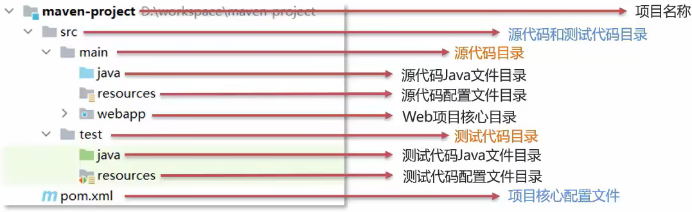
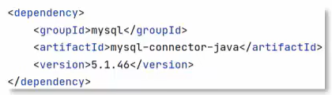
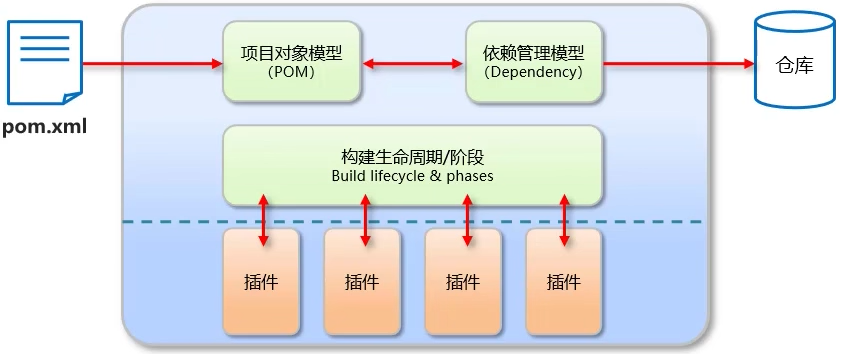
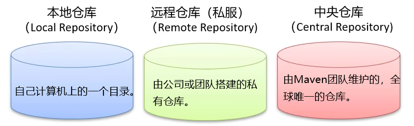
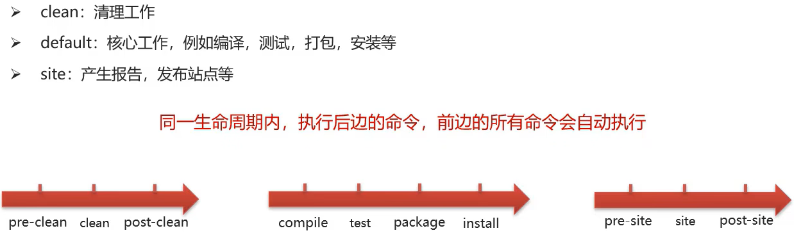
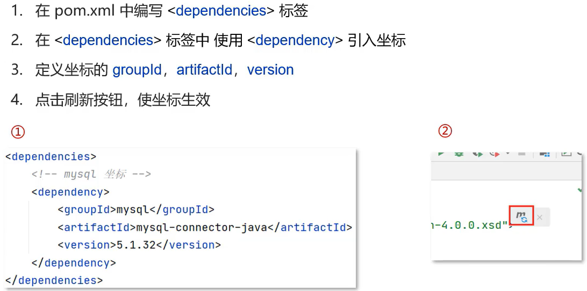
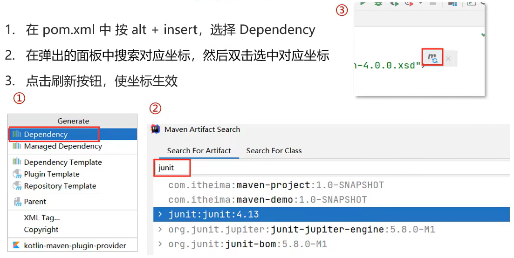
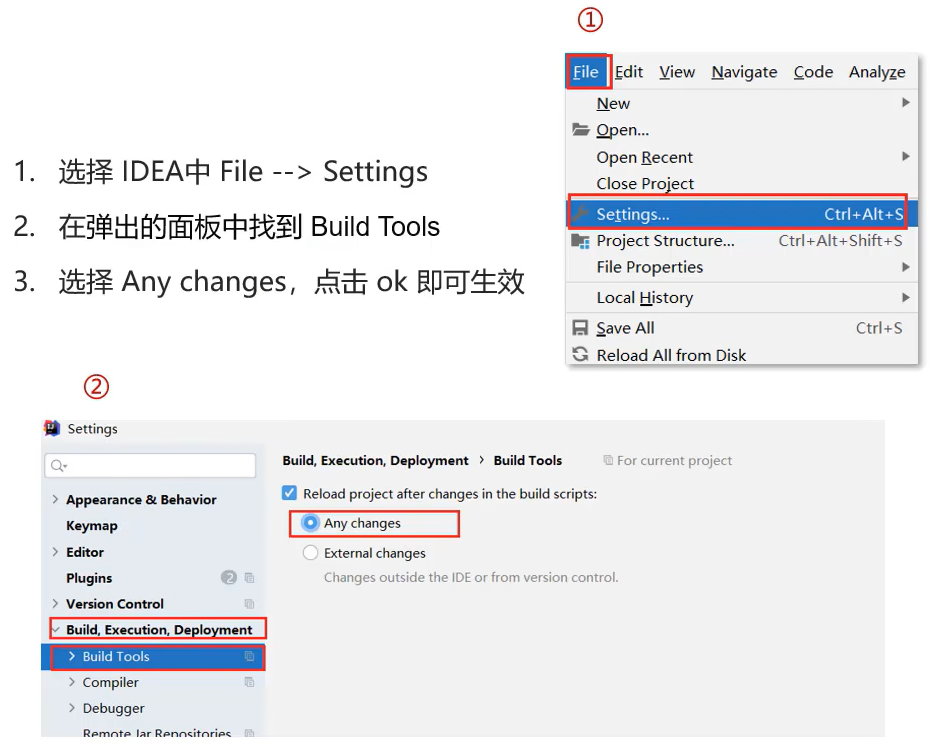
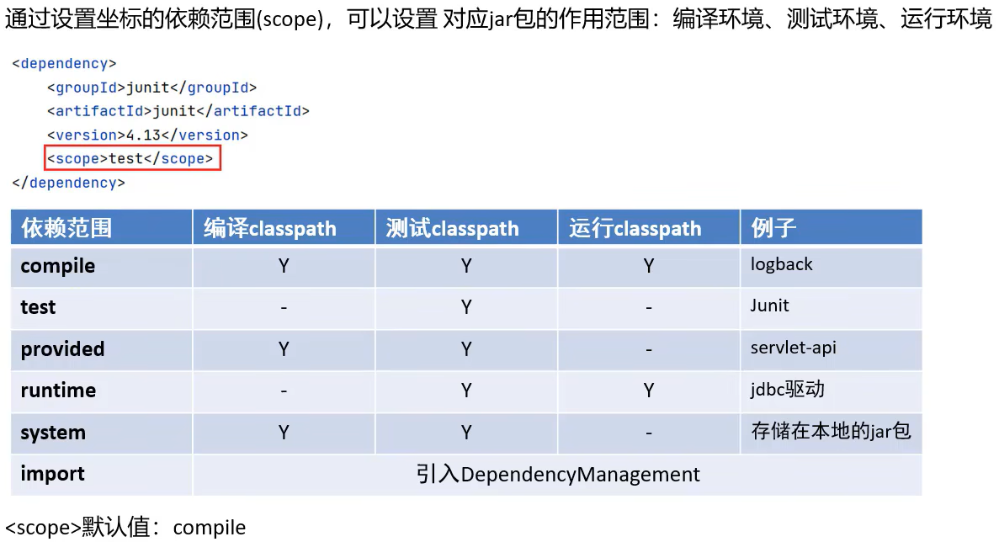

&emsp;&emsp;Maven 是用于管理和构建 Java 项目的工具，其主要功能有：

* 提供了一套标准化的项目结构，使所有 IDE 使用 Maven 构建的项目结构完全一样，不同 IDE 创建的 Maven 项目都可以通用。

* 提供了一套标准化的构建流程（提供了一套简单的命令来完成项目的构建）。

* 提供了一套依赖管理机制，使用标准的坐标配置来管理各种依赖。


> Maven 模型



> Maven 仓库



# 一、安装配置

> 环境变量

* 创建环境变量： `MAVEN_HOME = Maven 安装目录`
* 在环境变量 PATH 中添加一项： `$MAVEN_HOME/bin`

> conf/settings.xml

```xml
<!-- 在 settings 标签下加入，指定本地仓库的位置 -->
<localRepository>某个位置</localRepository>

<!-- 在 mirrors 标签下加入，阿里云远程仓库 -->
<mirror>
	<id>alimaven</id>
	<mirrorOf>central</mirrorOf>
	<name>aliyun maven</name>
	<url>http://maven.aliyun.com/nexus/content/groups/public
	</url>
</mirror>
```

# 二、基本使用

> Maven 提供的命令，先进入 pom.xml 配置文件所在的目录，再执行命令：

```sh
# 编译
mvn compile

# 清理
mvn clean

# 打包
mvn package

# 测试
mvn test

# 安装，把生成的 jar 包安装到本地仓库
mvn install
```

> Maven 项目的生命周期分为 3 套



> Maven 坐标

&emsp;&emsp;坐标，即 Maven 中资源的唯一标识。我们使用坐标来定义项目或引入项目中需要的依赖。

* groupId：定义当前 Maven 项目隶属组织名称
* artifactId：定义当前 Maven 项目（模块）名称
* version：定义当前项目版本号

```xml
<!-- 定义当前项目 -->
<groupId>com.itheima</groupId>
<artifactId>maven-demo</artifactId>
<version>1.0-SNAPSHOT</version>

<!-- 解决依赖 -->
<dependency>
	<groupId>com.itheima</groupId>
	<artifactId>maven-demo</artifactId>
	<version>1.0-SNAPSHOT</version>
</dependency>
```

> 依赖管理

* 引入 jar 包



* 搜索本地 jar 包，自动引入



* 配置自动生效



> 依赖范围

