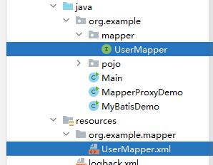
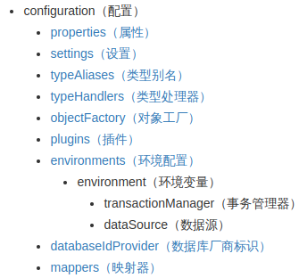

# 一、MybatisDemo

>写入依赖坐标到 pom.xml 配置文件，并同步这些依赖

```xml
<?xml version="1.0" encoding="UTF-8"?>
<project xmlns="http://maven.apache.org/POM/4.0.0"
         xmlns:xsi="http://www.w3.org/2001/XMLSchema-instance"
         xsi:schemaLocation="http://maven.apache.org/POM/4.0.0
         http://maven.apache.org/xsd/maven-4.0.0.xsd">
    <modelVersion>4.0.0</modelVersion>
    
    <groupId>org.example</groupId>
    <artifactId>mybatis-demo</artifactId>
    <version>1.0-SNAPSHOT</version>
	
    <properties>
        <maven.compiler.source>8</maven.compiler.source>
        <maven.compiler.target>8</maven.compiler.target>
        <project.build.sourceEncoding>UTF-8</project.build.sourceEncoding>
    </properties>
	
    <dependencies>
	    <!-- mybatis 核心依赖 -->
        <dependency>
            <groupId>org.mybatis</groupId>
            <artifactId>mybatis</artifactId>
            <version>3.5.5</version>
        </dependency>
        <dependency>
            <groupId>mysql</groupId>
            <artifactId>mysql-connector-java</artifactId>
            <version>8.0.26</version>
        </dependency>
        <dependency>
            <groupId>junit</groupId>
            <artifactId>junit</artifactId>
            <version>4.13</version>
            <scope>test</scope>
        </dependency>
		<!-- 添加 slf4j日志api -->
        <dependency>
            <groupId>org.slf4j</groupId>
            <artifactId>slf4j-api</artifactId>
            <version>1.7.20</version>
        </dependency>
		<!-- 添加logback-classic依赖 -->
        <dependency>
            <groupId>ch.qos.logback</groupId>
            <artifactId>logback-classic</artifactId>
            <version>1.2.3</version>
        </dependency>
		<!-- 添加logback-core依赖 -->
        <dependency>
            <groupId>ch.qos.logback</groupId>
            <artifactId>logback-core</artifactId>
            <version>1.2.3</version>
        </dependency>
    </dependencies>
	
</project>
```

> 在 resources 目录下，编写 Mybatis 核心配置文件 mybatis-config.xml

```xml
<?xml version="1.0" encoding="UTF-8" ?>  
<!DOCTYPE configuration PUBLIC "-//mybatis.org//DTD Config 3.0//EN" "http://mybatis.org/dtd/mybatis-3-config.dtd">  
<configuration>  
    <environments default="development">  
        <environment id="development">  
            <transactionManager type="JDBC"/>  
            <dataSource type="POOLED">
                <!--数据库的连接信息-->
                <property name="driver" value="com.mysql.cj.jdbc.Driver"/>
                <property name="url" value="jdbc:mysql://127.0.0.1:3306/mybatis?allowPublicKeyRetrieval=true&amp;useSSL=false"/>
                <property name="username" value="root"/>
                <property name="password" value="123456"/>
            </dataSource>
        </environment>
    </environments>
    <!--加载SQL的映射文件-->
    <mappers>
        <mapper resource="UserMapper.xml"/>
        <mapper resource="org/example/mapper/UserMapper.xml"/>
    </mappers>
</configuration>
```

> 在 resources 目录下，编写 logback 配置文件 logback.xml

```xml
<?xml version="1.0" encoding="UTF-8"?>

<!-- 配置文件修改时重新加载，默认true -->  
<configuration scan="true">  
	
    <!--定义日志文件的存储地址 勿在 LogBack 的配置中使用相对路径-->  
    <property name="CATALINA_BASE" value="**/logs"></property>  
  
    <!-- 控制台输出 -->  
    <appender name="CONSOLE" class="ch.qos.logback.core.ConsoleAppender">  
        <encoder charset="UTF-8">  
            <!-- 输出日志记录格式 -->  
            <pattern>%d{yyyy-MM-dd HH:mm:ss.SSS} [%thread] %-5level %logger{36} - %msg%n</pattern>  
        </encoder>  
    </appender>  
  
    <!-- 第一个文件输出,每天产生一个文件 -->  
    <appender name="FILE1" class="ch.qos.logback.core.rolling.RollingFileAppender">  
        <rollingPolicy class="ch.qos.logback.core.rolling.TimeBasedRollingPolicy">  
            <!-- 输出文件路径+文件名 -->  
            <fileNamePattern>${CATALINA_BASE}/aa.%d{yyyyMMdd}.log</fileNamePattern>  
            <!-- 保存30天的日志 -->  
            <maxHistory>30</maxHistory>  
        </rollingPolicy>  
        <encoder charset="UTF-8">  
            <!-- 输出日志记录格式 -->  
            <pattern>%d{yyyy-MM-dd HH:mm:ss.SSS} [%thread] %-5level %logger{36} - %msg%n</pattern>  
        </encoder>  
    </appender>  
  
    <!-- 第二个文件输出,每天产生一个文件 -->  
    <appender name="FILE2" class="ch.qos.logback.core.rolling.RollingFileAppender">  
        <file>${CATALINA_BASE}/bb.log</file>  
        <rollingPolicy class="ch.qos.logback.core.rolling.TimeBasedRollingPolicy">  
            <fileNamePattern>${CATALINA_BASE}/bb.%d{yyyyMMdd}.log</fileNamePattern>  
            <maxHistory>30</maxHistory>  
        </rollingPolicy>  
        <encoder charset="UTF-8">  
            <pattern>%d{yyyy-MM-dd HH:mm:ss.SSS} [%thread] %-5level %logger{36} - %msg%n</pattern>  
        </encoder>
    </appender>  
  
    <appender name="CUSTOM" class="ch.qos.logback.core.rolling.RollingFileAppender">  
        <file>${CATALINA_BASE}/custom.log</file>  
        <rollingPolicy class="ch.qos.logback.core.rolling.TimeBasedRollingPolicy">  
            <!-- daily rollover -->  
            <fileNamePattern>${CATALINA_BASE}/custom.%d{yyyy-MM-dd}.log</fileNamePattern>  
            <!-- keep 30 days' worth of history -->  
            <maxHistory>30</maxHistory>  
        </rollingPolicy>  
        <encoder charset="UTF-8">  
            <pattern>%d{yyyy-MM-dd HH:mm:ss.SSS} [%thread] %-5level %logger{36} - %msg%n</pattern>  
        </encoder>  
    </appender>  
  
    <!-- 设置日志输出级别 -->  
    <root level="ERROR">  
        <appender-ref ref="CONSOLE" />  
    </root>
    <logger name="file1" level="DEBUG">  
        <appender-ref ref="FILE1" />  
    </logger>
    <logger name="file1" level="INFO">  
        <appender-ref ref="FILE2" />  
    </logger>
    <!-- 自定义logger -->  
    <logger name="custom" level="INFO">  
        <appender-ref ref="CUSTOM" />  
    </logger>
    
</configuration>
```

> 在 resources 目录下，编写 SQL 映射文件 UserMapper.xml

```xml
<?xml version="1.0" encoding="UTF-8" ?>
<!DOCTYPE mapper
        PUBLIC "-//mybatis.org//DTD Mapper 3.0//EN"
        "http://mybatis.org/dtd/mybatis-3-mapper.dtd">
<mapper namespace="test">
    <select id="selectAll" resultType="org.example.pojo.User">
        select * from t_user;
    </select>
</mapper>
```

> 编写 Java 代码 MyBatisDemo.java

```java
import org.apache.ibatis.io.Resources;
import org.apache.ibatis.session.SqlSession;
import org.apache.ibatis.session.SqlSessionFactory;
import org.apache.ibatis.session.SqlSessionFactoryBuilder;
import org.example.pojo.User;
  
import java.io.IOException;
import java.io.InputStream;
import java.util.List;

public class MyBatisDemo {
    public static void main(String[] args) throws IOException {
        //获取SqlSessionFactory对象
        String resource = "mybatis-config.xml";
        InputStream inputStream = Resources.getResourceAsStream(resource);
        SqlSessionFactory sqlSessionFactory = new SqlSessionFactoryBuilder().build(inputStream);
        
        //获取SqlSession对象，用它来执行sql
        SqlSession sqlSession = sqlSessionFactory.openSession();
        
        //执行sql
        List<User> users = sqlSession.selectList("test.selectAll");
        
        //输出执行结果
        System.out.println(users);
        
		//关闭连接
        sqlSession.close();
    }
}
```

# 二、Mapper 代理开发

&emsp;&emsp;以上 Demo 的 Java 代码中仍然存在硬编码的问题。 我们可以通过使用 Mapper 代理的方法，彻底地解决这个问题。

> 定义与 SQL 映射文件同名的 Mapper 接口，并且将 Mapper 接口和映射文件放置在同一目录下



> 设置 SQL 映射文件的 namespace 属性为 Mapper 接口的全限定名

```xml
<mapper namespace="org.example.mapper.UserMapper">
    <select id="selectAll" resultType="org.example.pojo.User">
        select * from t_user;
    </select>
</mapper>
```

> 在 Mapper 接口中定义方法，方法名就是 SQL 映射文件中 sql 语句的 id，并保持参数类型和返回值类型与 SQL 映射文件中的一致

```xml
package org.example.mapper;

import org.example.pojo.User;
import java.util.List;

public interface UserMapper {
    List<User> selectAll();
}
```

> 在 mybatis-config.xml 中配置映射文件位置

```xml
<mappers>
    <mapper resource="org/example/mapper/UserMapper.xml" />
</mappers>
```

> 编写 Java 代码

```java
package org.example;  

import org.apache.ibatis.io.Resources;  
import org.apache.ibatis.session.SqlSession;  
import org.apache.ibatis.session.SqlSessionFactory;  
import org.apache.ibatis.session.SqlSessionFactoryBuilder;  
import org.example.mapper.UserMapper;  
import org.example.pojo.User;  

import java.io.IOException;  
import java.io.InputStream;  
import java.util.List;  
  
//Mapper 代理  
public class MapperProxyDemo {  
    public static void main(String[] args) throws IOException {  
        //获取SqlSessionFactory对象
        String resource = "mybatis-config.xml";  
        InputStream inputStream = Resources.getResourceAsStream(resource);  
        SqlSessionFactory sqlSessionFactory = new SqlSessionFactoryBuilder().build(inputStream);  
  
        //获取SqlSession对象，用它来执行sql  
        SqlSession sqlSession = sqlSessionFactory.openSession();  
  
        UserMapper userMapper = sqlSession.getMapper(UserMapper.class);  
        List<User> users = userMapper.selectAll();  
  
        System.out.println(users);  
		
        sqlSession.close();  
    }  
}
```

> 解决：数据库中的列名和实体的属性名不一致

```xml
<!--
	写在 Mapper 映射文件中，mapper 标签的上方
	有两个属性
	    id: 唯一标识
	    type：映射的类型
-->
<resultMap id="brandResultMap" type="org.example.pojo.Brand">
    <!--
        有两种子标签
        id：完成主键字段映射
        result：完成一般字段的映射
    -->
    <result column="brand_name" property="brandName" />
    <result column="company_name" property="companyName" />
</resultMap>
```

# 三、Mybatis 核心配置文件 mybatis-config.xml



注意：配置文件中**各个配置项的先后顺序绝对不能颠倒**（xml 约束）。

> environments：配置数据库的连接环境信息，可以配置多个 environment，通过 default 属性切换不同的 environment

```xml
    <environments default="development">
        <environment id="development">
	        <!-- 事务管理 -->
            <transactionManager type="JDBC"/>
            <!-- 数据库连接池 -->
            <dataSource type="POOLED">
                <!--数据库的连接信息-->
                <property name="driver" value="com.mysql.cj.jdbc.Driver"/>
                <property name="url" value="jdbc:mysql://127.0.0.1:3306/mybatis?allowPublicKeyRetrieval=true&amp;useSSL=false"/>
                <property name="username" value="root"/>
                <property name="password" value="123456"/>
            </dataSource>
        </environment>
    </environments>
```

> mappers：注册映射文件

```xml
<mappers>
	<mapper resource="org/example/mapper/UserMapper.xml" />
</mappers>
```

> typeAlias：类型别名

```xml
<typeAlias>
	<packages name="com.itheima.pojo" />
</typeAlias>
```
# 四、参数传递

> 单个参数

* 接口

```java
public interface BrandMapper {
    List<Brand> selectById(Integer id);
}
```

* 对应的 Mapper 配置项

```xml
<!--两种参数占位符
	#{} 会将参数替换为 ? ，不会存在 SQL 注入问题，传递参数时使用
	${} 拼字符串，会存在 SQL 注入问题，在表名或列名不固定的情况下使用
-->
<select id="selectById" resultMap="brandResultMap">
    select * from t_brand where id = #{id};
</select>
<!-- 参数的类型 parameterType 可以省略 -->
<!-- sql 中的特殊字符
	转义字符： &lt;
	CDATA 区：<![CDATA[<]]>
	CDATA 中的内容都被作为普通字符处理
-->
```

> 多个参数

```xml
<select id="selectByCondition" resultType="org.mybatis.demo.pojo.Brand">
	select *
	from t_brand
	where
		status = #{status}
		and company_name like #{companyName}
		and brand_name like #{brandName};
</select>
```

* 散装参数

```java
List<Brand> selectByCondition(@Param("status")int status,@Param("companyName")String companyName,@Param("brandName")String brandName);
//Param 注解中的字符串与 sql 中的占位符必须分别对应一致
```

* 传递 Brand 实体

```java
List<Brand> selectByCondition(Brand brand);
//要求实体的各个属性的名称与 sql 中占位符的名称必须一致
```

* 传递 Map 集合

```java
//接口方法
List<Brand> selectByCondition(Map map);

//调用时
Map map = new HashMap();
```
# 五、动态条件查询

# 六、注解开发
