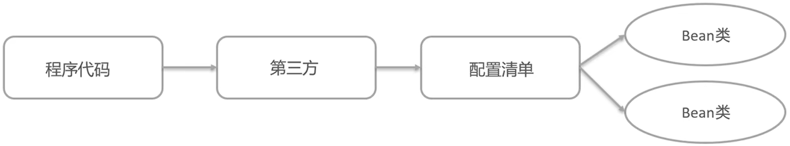

# 零、Spring 框架概述

&emsp;&emsp;每一个 Java 程序员，都是 Spring 程序员。

> 三种思想的提出

* IoC(Inversion of Control) 控制反转思想，将原来在程序中创建 Bean 的权利反转给第三方；
* DI(Dependency Injection) 依赖注入思想，Bean 之间的关系由第三方负责去设置；
* AOP(Aspect Oriented Programming) 面向切面思想，功能的横向抽取，主要实现的就是 Proxy。

> Spring 框架

&emsp;&emsp;Spring 是一个开源的轻量级 Java 开发应用框架，可以简化企业级应用开发。Spring 解决了开发者在 JavaEE 开发中遇到的许多常见问题，提供了功能强大的 IoC、AOP 以及 Web MVC 等功能。

&emsp;&emsp;Spring 是当前企业中 Java 开发几乎不能缺少的框架之一。Spring 的生态极其完善，不管是 Spring 哪个领域的解决方案都是依附于 Spring Framework 基础框架的。

> Spring 框架的历史

* JSP 默默抗下所有；
* MVC+ 三层架构分工明确，但是开发成本极其高；
* EJB 重量级框架出现，走出一个困境，又进入另一个困境；
* Spring 的春天来到，随之 SSH 风生水起、称霸武林；
* Spring 稳住江湖大哥的位置，SSM 开始上位；
# 一、快速入门
## 1.BeanFactory



> 开发步骤

* 导入 Spring 的 jar 包或 Maven 坐标；
* 定义 UserService 接口及其 UserServiceImpl 实现类；
* 创建 beans.xml 配置文件，将 UserServiceImpl 的信息配置到该 xml 中；
* 编写测试代码，创建 BeanFactory，加载配置文件，获取 UserService 实例对象。

> 代码实例

* pom.xml 配置文件

```xml
<?xml version="1.0" encoding="UTF-8"?>  
<project xmlns="http://maven.apache.org/POM/4.0.0"  
         xmlns:xsi="http://www.w3.org/2001/XMLSchema-instance"  
         xsi:schemaLocation="http://maven.apache.org/POM/4.0.0 http://maven.apache.org/xsd/maven-4.0.0.xsd">  
    <modelVersion>4.0.0</modelVersion>  
  
    <groupId>org.example</groupId>  
    <artifactId>spring-ioc-test01</artifactId>  
    <version>1.0-SNAPSHOT</version>  
  
    <properties>  
        <maven.compiler.source>21</maven.compiler.source>  
        <maven.compiler.target>21</maven.compiler.target>  
        <project.build.sourceEncoding>UTF-8</project.build.sourceEncoding>  
    </properties>  

	<!-- 导入 spring 依赖 -->
    <dependencies>  
        <dependency>  
            <groupId>org.springframework</groupId>  
            <artifactId>spring-context</artifactId>  
            <version>5.3.8</version>  
        </dependency>  
    </dependencies>  
  
</project>
```

* beans.xml 配置文件（resources 目录下）

```xml
<?xml version="1.0" encoding="UTF-8"?>
<beans xmlns="http://www.springframework.org/schema/beans"
    xmlns:xsi="http://www.w3.org/2001/XMLSchema-instance"
    xsi:schemaLocation="http://www.springframework.org/schema/beans
                        http://www.springframework.org/schema/beans/spring-beans.xsd">
	
</beans>
```

* com.itheima.service.UserService.java

```java
package com.itheima.service;
  
public interface UserService {

}
```

* com.itheima.service.impl.UserServiceImpl.java

```java
package com.itheima.service.impl;

import com.itheima.service.UserService;

public class UserServiceImpl implements UserService {

}
```

* com.itheima.BeanFactoryTest.java

```java
package com.itheima;

import com.itheima.service.UserService;
import org.springframework.beans.factory.support.DefaultListableBeanFactory;
import org.springframework.beans.factory.xml.XmlBeanDefinitionReader;
  
public class BeanFactoryTest {
    public static void main(String[] args) {
        //创建工厂对象
        DefaultListableBeanFactory beanFactory = new DefaultListableBeanFactory();
        
        //创建一个读取器（xml 文件）
        XmlBeanDefinitionReader reader = new XmlBeanDefinitionReader(beanFactory);
		
        //读取器读取配置文件给工厂
        reader.loadBeanDefinitions("beans.xml");
        
        //根据 id 获取 Bean 对象
        UserService userService = (UserService) beanFactory.getBean("userService");
		
		//输出测试
        System.out.println(userService);
    }
}
```
## 2.ApplicationContext


# 二、基于 XML 方式的 Bean 的配置


# 三、Spring 配置非自定义的 Bean


