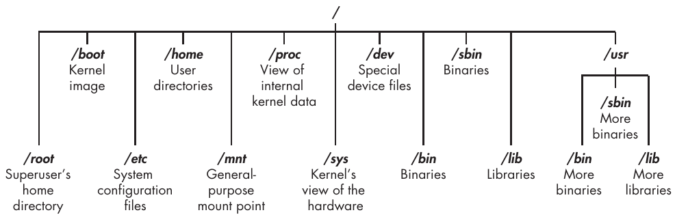

# 1 Basic 

## 1.1 Introductory Terms and Concepts

### Binaries

&emsp;&emsp;This term refers to files that can be executed, similar to executables in Windows.

### Case sensitivity

&emsp;&emsp;Unlike Windows, the Linux filesystem is case sensitive. This means that Desktop is different from desktop, which is different from DeskTop. Each of these would represent a different file or directory name.

### Directory

&emsp;&emsp;This is the same as a folder in Windows. A directory provides a way of organizing files, usually in a hierarchical manner.

### Terminal

&emsp;&emsp;This is a command line interface (CLI).

## 1.2 The Linux Filesystem

## 1.3 Basic Commands in Linux

# 2 Text Manipulation

## 2.1 Viewing Files

### Finding the Head

### Finding the Tail

### Numbering the Lines
